# GitHub Contrib Runner

Generate a custom animated SVG from a GitHub contribution calendar.

This started as an alternative to the common Snake and Pac-Man profile animations. Instead of cloning either idea directly, it renders a contribution grid with a moving runner, scan light, pulse effects, and themeable colors.

## Preview



## Usage

Create this workflow in `.github/workflows/contrib-runner.yml`:

```yml
name: Commit Runner Animation

on:
  schedule:
    - cron: "0 0 * * *"
  workflow_dispatch:
  push:
    branches: [main]

jobs:
  generate:
    runs-on: ubuntu-latest
    permissions:
      contents: write

    steps:
      - uses: actions/checkout@v4

      - name: Generate Commit Runner animation
        uses: WendellOttoni/github-contrib-runner@main
        with:
          username: ${{ github.repository_owner }}
          theme: fire
          output: dist/contrib-runner.svg

      - name: Push output to dist branch
        uses: crazy-max/ghaction-github-pages@v3
        with:
          target_branch: output
          build_dir: dist
        env:
          GITHUB_TOKEN: ${{ secrets.GITHUB_TOKEN }}
```

Then add the generated SVG to your README:

```md

```

For example, in this profile repository:

```md

```

## Examples

### Test in Any Repository

You do not need to test it directly in your profile README. Create any repository, add the workflow above, run it from the **Actions** tab, and point the README image to that repository:

```md

```

The SVG is generated from the `username` input, not from the repository where the workflow runs. That means a test repository can render your real contribution calendar:

```yml
- name: Generate Commit Runner animation
  uses: WendellOttoni/github-contrib-runner@main
  with:
    username: WendellOttoni
    theme: fire
    output: dist/contrib-runner.svg
```

### Themes

Use `fire` to match orange/red profile designs:

```yml
with:
  username: WendellOttoni
  theme: fire
  title: Commit Runner
  output: dist/contrib-runner.svg
```

Use `neon` for a cyan/purple style:

```yml
with:
  username: WendellOttoni
  theme: neon
  title: Neon Runner
  output: dist/contrib-runner.svg
```

Use `ocean` for a blue/cyan style:

```yml
with:
  username: WendellOttoni
  theme: ocean
  title: Ocean Runner
  output: dist/contrib-runner.svg
```

### Custom Output File

You can generate more than one variant by calling the action multiple times:

```yml
- name: Generate fire animation
  uses: WendellOttoni/github-contrib-runner@main
  with:
    username: WendellOttoni
    theme: fire
    output: dist/contrib-runner-fire.svg

- name: Generate neon animation
  uses: WendellOttoni/github-contrib-runner@main
  with:
    username: WendellOttoni
    theme: neon
    output: dist/contrib-runner-neon.svg
```

## Inputs

| Name | Default | Description |
| --- | --- | --- |
| `username` | `${{ github.repository_owner }}` | GitHub username to render. |
| `token` | `${{ github.token }}` | Token used to read contribution data. |
| `output` | `dist/contrib-runner.svg` | Output SVG path. |
| `title` | `Commit Runner` | SVG title. |
| `theme` | `fire` | Theme name: `fire`, `neon`, or `ocean`. |

## Development

The action is dependency-free and runs with the Node.js version available on GitHub-hosted runners.

```bash
INPUT_USERNAME=WendellOttoni INPUT_TOKEN=ghp_example INPUT_OUTPUT=dist/contrib-runner.svg node src/cli.mjs
```

Never commit real GitHub tokens.
