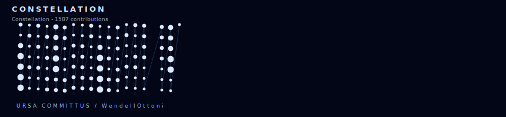

# GitHub Contrib Runner

Generate a custom animated SVG from a GitHub contribution calendar.

This started as an alternative to the common Snake and Pac-Man profile animations. Instead of cloning either idea directly, it renders a contribution grid with a moving runner, scan light, pulse effects, and themeable colors.

## Preview Gallery

### Commit Runner



### Commit Invaders



### Train Code



### Rocket Trail



### Data Pulse



### Code Miner



### Laser Scanner



### Code Miner Minecraft


### Hash Cracker



### Build Pipeline


### City Skyline


### Constellation



## Usage

Create this workflow in `.github/workflows/contrib-runner.yml`:

```yml
name: Commit Runner Animation

on:
  schedule:
    - cron: "0 0 * * *"
  workflow_dispatch:
  push:
    branches: [main]

jobs:
  generate:
    runs-on: ubuntu-latest
    permissions:
      contents: write

    steps:
      - uses: actions/checkout@v4

      - name: Generate Commit Runner animation
        uses: WendellOttoni/github-contrib-runner@main
        with:
          username: ${{ github.repository_owner }}
          variant: runner
          theme: fire
          output: dist/contrib-runner.svg

      - name: Push output to dist branch
        uses: crazy-max/ghaction-github-pages@v3
        with:
          target_branch: output
          build_dir: dist
        env:
          GITHUB_TOKEN: ${{ secrets.GITHUB_TOKEN }}
```

Then add the generated SVG to your README:

```md

```

For example, in this profile repository:

```md

```

## Examples

### Test in Any Repository

You do not need to test it directly in your profile README. Create any repository, add the workflow above, run it from the **Actions** tab, and point the README image to that repository:

```md

```

The SVG is generated from the `username` input, not from the repository where the workflow runs. That means a test repository can render your real contribution calendar:

```yml
- name: Generate Commit Runner animation
  uses: WendellOttoni/github-contrib-runner@main
  with:
    username: WendellOttoni
    variant: rocket
    theme: fire
    output: dist/contrib-runner.svg
```

## Prototypes

The `prototypes/` directory contains standalone HTML generators used to explore new animation concepts before they become Action variants. GitHub does not render these HTML files directly inside the README, so open them locally in a browser to preview, re-roll sample data, and download the generated SVG.

### Prototype Examples

| Prototype | Open locally | Status |
| --- | --- | --- |
| Commit Invaders | [`prototypes/commit_invaders.html`](prototypes/commit_invaders.html) | Ported to `variant: spaceship`. |
| Code Miner Minecraft | [`prototypes/code_miner_minecraft.html`](prototypes/code_miner_minecraft.html) | Ported to `variant: minecraft`. |
| Hash Cracker | [`prototypes/hash_cracker.html`](prototypes/hash_cracker.html) | Ported to `variant: hash`. |
| Build Pipeline | [`prototypes/build_pipeline.html`](prototypes/build_pipeline.html) | Ported to `variant: pipeline`. |
| City Skyline | [`prototypes/city_skyline.html`](prototypes/city_skyline.html) | Ported to `variant: city`. |
| Constellation | [`prototypes/constellation.html`](prototypes/constellation.html) | Ported to `variant: constellation`. |
| Etch-a-Sketch | [`prototypes/etch_a_sketch.html`](prototypes/etch_a_sketch.html) | Prototype. |

To preview them:

```bash
git clone https://github.com/WendellOttoni/github-contrib-runner.git
cd github-contrib-runner
```

Then open any file from `prototypes/` in your browser. Each prototype has:

- dark and light previews;
- a re-roll button with simulated contribution data;
- a download button for the generated SVG;
- SVG source preview for inspection.

Prototype HTML files are not Action variants yet. To use a prototype with real GitHub contribution data, its renderer must first be ported into `src/render.mjs` and added to the `variant` input.

The already ported example is `Commit Invaders`:

```yml
with:
  username: WendellOttoni
  variant: spaceship
  output: dist/commit-invaders.svg
```

### Variants

Choose one of these values with the `variant` input:

| Variant | Concept |
| --- | --- |
| `runner` | Energy cursor crossing active days. |
| `spaceship` | Space Invaders style ship shooting contribution blocks from below. |
| `train` | Tiny train moving through the commit line. |
| `rocket` | Rocket leaving a trail over contribution peaks. |
| `pulse` | Signal activating the calendar as it travels. |
| `miner` | Miner collecting contribution blocks. |
| `scanner` | Scanner reading contribution intensity. |
| `minecraft` | Faithful Minecraft-style miner prototype using real contribution data. |
| `hash` | Faithful terminal hash cracker prototype using real contribution data. |
| `pipeline` | Faithful CI/CD build pipeline prototype using real contribution data. |
| `city` | Faithful city skyline prototype using real contribution data. |
| `constellation` | Faithful animated star chart prototype using real contribution data. |

```yml
with:
  username: WendellOttoni
  variant: spaceship
  theme: neon
  title: Commit Invaders
  output: dist/contrib-runner.svg
```

### Themes

Use `fire` to match orange/red profile designs:

```yml
with:
  username: WendellOttoni
  variant: runner
  theme: fire
  title: Commit Runner
  output: dist/contrib-runner.svg
```

Use `neon` for a cyan/purple style:

```yml
with:
  username: WendellOttoni
  variant: pulse
  theme: neon
  title: Neon Runner
  output: dist/contrib-runner.svg
```

Use `ocean` for a blue/cyan style:

```yml
with:
  username: WendellOttoni
  variant: scanner
  theme: ocean
  title: Ocean Runner
  output: dist/contrib-runner.svg
```

### Custom Output File

You can generate more than one variant by calling the action multiple times:

```yml
- name: Generate fire animation
  uses: WendellOttoni/github-contrib-runner@main
  with:
    username: WendellOttoni
    variant: rocket
    theme: fire
    output: dist/contrib-runner-fire.svg

- name: Generate neon animation
  uses: WendellOttoni/github-contrib-runner@main
  with:
    username: WendellOttoni
    variant: spaceship
    theme: neon
    output: dist/contrib-runner-neon.svg
```

## Inputs

| Name | Default | Description |
| --- | --- | --- |
| `username` | `${{ github.repository_owner }}` | GitHub username to render. |
| `token` | `${{ github.token }}` | Token used to read contribution data. |
| `output` | `dist/contrib-runner.svg` | Output SVG path. |
| `title` | Variant label | SVG title. |
| `theme` | `fire` | Theme name: `fire`, `neon`, or `ocean`. |
| `variant` | `runner` | Animation variant: `runner`, `spaceship`, `train`, `rocket`, `pulse`, `miner`, `scanner`, `minecraft`, `hash`, `pipeline`, `city`, or `constellation`. |

## Development

The action is dependency-free and runs with the Node.js version available on GitHub-hosted runners.

```bash
INPUT_USERNAME=WendellOttoni INPUT_TOKEN=ghp_example INPUT_VARIANT=rocket INPUT_OUTPUT=dist/contrib-runner.svg node src/cli.mjs
```

Never commit real GitHub tokens.

Generate the preview gallery with simulated data:

```bash
node src/generate-previews.mjs
```
