# GitHub Contrib Runner

Generate a custom animated SVG from a GitHub contribution calendar.

The Action currently focuses on the most customized variants: game-like, terminal-like, pipeline, skyline, and constellation renderers. Earlier generic cursor variants are disabled for now while the project moves toward richer concepts.

## Preview Gallery

### Commit Invaders


### Code Miner Minecraft


### Hash Cracker


### Build Pipeline


### City Skyline


### Constellation


### Etch-a-Sketch



### Dungeon Crawler



## Usage

Create this workflow in `.github/workflows/contrib-runner.yml`:

```yml
name: Contribution Animation

on:
  schedule:
    - cron: "0 3 * * *"
  workflow_dispatch:
  push:
    branches: [main]

jobs:
  generate:
    runs-on: ubuntu-latest
    permissions:
      contents: write

    steps:
      - uses: actions/checkout@v4

      - name: Generate contribution animation
        uses: WendellOttoni/github-contrib-runner@main
        with:
          username: ${{ github.repository_owner }}
          variant: spaceship
          theme: neon
          output: dist/contrib-runner.svg

      - name: Push output to output branch
        uses: crazy-max/ghaction-github-pages@v3
        with:
          target_branch: output
          build_dir: dist
        env:
          GITHUB_TOKEN: ${{ secrets.GITHUB_TOKEN }}
```

Then add the generated SVG to your README:

```md

```

For example, in this profile repository:

```md

```

## Variants

Choose one of these values with the `variant` input:

| Variant | Concept |
| --- | --- |
| `spaceship` | Commit Invaders: a ship shoots contribution blocks from below. |
| `minecraft` | Code Miner Minecraft: a miner breaks contribution ore blocks. |
| `hash` | Hash Cracker: terminal hash stream decrypts active contribution days. |
| `pipeline` | Build Pipeline: commits travel through CI stages. |
| `city` | City Skyline: weekly contribution towers build a skyline. |
| `constellation` | Constellation: contribution days become an animated star chart. |
| `etch` | Etch-a-Sketch: contributions drive a line drawing animation. |
| `dungeon` | Dungeon Crawler: contributions become rooms in a dungeon run. |

```yml
with:
  username: WendellOttoni
  variant: city
  theme: ocean
  title: City Skyline
  output: dist/contrib-runner.svg
```

## Themes

The current themes are `fire`, `neon`, and `ocean`. Some variants use their own detailed palette internally, but the input remains available for variants that use shared theme colors.

```yml
with:
  username: WendellOttoni
  variant: hash
  theme: neon
  title: Hash Cracker
  output: dist/contrib-runner.svg
```

## Multiple Outputs

You can generate more than one variant by calling the action multiple times:

```yml
- name: Generate city animation
  uses: WendellOttoni/github-contrib-runner@main
  with:
    username: WendellOttoni
    variant: city
    theme: ocean
    output: dist/contrib-runner-city.svg

- name: Generate constellation animation
  uses: WendellOttoni/github-contrib-runner@main
  with:
    username: WendellOttoni
    variant: constellation
    theme: neon
    output: dist/contrib-runner-constellation.svg
```

## Prototypes

The `prototypes/` directory contains standalone HTML generators used to explore new animation concepts before they become Action variants. GitHub does not render these HTML files directly inside the README, so open them locally in a browser to preview, re-roll sample data, and download the generated SVG.

| Prototype | Open locally | Status |
| --- | --- | --- |
| Commit Invaders | [`prototypes/commit_invaders.html`](prototypes/commit_invaders.html) | Ported to `variant: spaceship`. |
| Code Miner Minecraft | [`prototypes/code_miner_minecraft.html`](prototypes/code_miner_minecraft.html) | Ported to `variant: minecraft`. |
| Hash Cracker | [`prototypes/hash_cracker.html`](prototypes/hash_cracker.html) | Ported to `variant: hash`. |
| Build Pipeline | [`prototypes/build_pipeline.html`](prototypes/build_pipeline.html) | Ported to `variant: pipeline`. |
| City Skyline | [`prototypes/city_skyline.html`](prototypes/city_skyline.html) | Ported to `variant: city`. |
| Constellation | [`prototypes/constellation.html`](prototypes/constellation.html) | Ported to `variant: constellation`. |
| Dungeon Crawler | [`prototypes/dungeon_crawler.html`](prototypes/dungeon_crawler.html) | Ported to `variant: dungeon`. |
| Etch-a-Sketch | [`prototypes/etch_a_sketch.html`](prototypes/etch_a_sketch.html) | Ported to `variant: etch`. |

To preview them:

```bash
git clone https://github.com/WendellOttoni/github-contrib-runner.git
cd github-contrib-runner
```

Then open any file from `prototypes/` in your browser. Each prototype has dark and light previews, a re-roll button with simulated contribution data, a download button, and an SVG source preview.

Prototype HTML files are not Action variants yet. To use a prototype with real GitHub contribution data, its renderer must first be ported into `src/` and added to the `variant` input.

## Inputs

| Name | Default | Description |
| --- | --- | --- |
| `username` | `${{ github.repository_owner }}` | GitHub username to render. |
| `token` | `${{ github.token }}` | Token used to read contribution data. |
| `output` | `dist/contrib-runner.svg` | Output SVG path. |
| `title` | Variant label | SVG title. |
| `theme` | `fire` | Theme name: `fire`, `neon`, or `ocean`. |
| `variant` | `spaceship` | Animation variant: `spaceship`, `minecraft`, `hash`, `pipeline`, `city`, `constellation`, `etch`, or `dungeon`. |

## Development

The action is dependency-free and runs with the Node.js version available on GitHub-hosted runners.

```bash
INPUT_USERNAME=WendellOttoni INPUT_TOKEN=ghp_example INPUT_VARIANT=city INPUT_OUTPUT=dist/contrib-runner.svg node src/cli.mjs
```

Never commit real GitHub tokens.

Generate the preview gallery with simulated data:

```bash
node src/generate-previews.mjs
```
